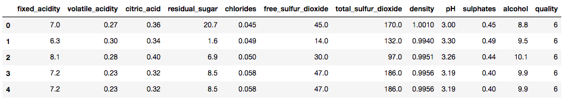

# Wine Analysis

# 1. INTRODUCTION

  ## 1.a. Why we need to do this analysis
  
  Everyone has an idea about the concept of wine quality. But when comes to defining precisely what that means there is often silence. For most wine critics, quality refers to what they personally consider ‘good’ versus ‘bad’ wine, and correspondingly desirable versus aversive. This is usually framed within the context of conformity relative to established, learned norms for the wines concerned. This indicates, and rightly so, that quality is not only subjective, but also involves both intrinsic (sensory) and extrinsic (contextual) components.
  
  There are specific reasons why it can better to ignore wine tasting notes, such as;
    * Tasting Notes can Prejudice or Influence Your Perception
    * Tasting Notes Can Set You Up for Failure
    * Tasting Notes Can Be Overwritten and Too Complicated
 
  ## 1.b. The problem

  As it can be concluded from above reasons, the problem is dependability of notes or scores of wine quality. We may not end the discussion on this topic but we can contribute. In order to make this contribution, we will try to predict wine quality with using its sensory inputs. 
  
  ## 1.c. The Dataset

  Two datasets are available of which one dataset is on red wine and have 1599 different varieties and the other is on white wine and have 4898 varieties. Only white wine data is analysed. All wines are produced in a particular area of Portugal. Data are collected on 12 different properties of the wines one of which is Quality, based on sensory data, and the rest are on chemical properties of the wines including density, acidity, alcohol content etc. All chemical properties of wines are continuous variables. Quality is an ordinal variable with possible ranking from 1 (worst) to 10 (best). Each variety of wine is tasted by three independent tasters and the final rank assigned is the median rank given by the tasters.

