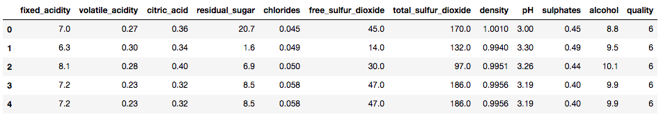
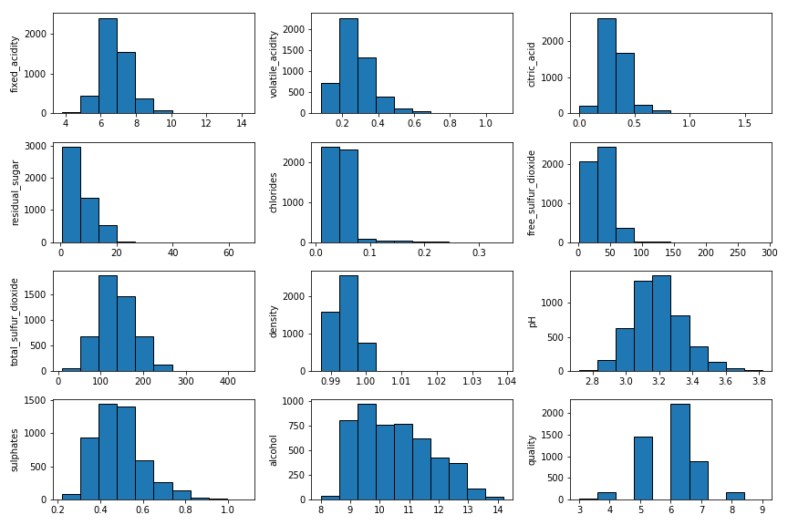
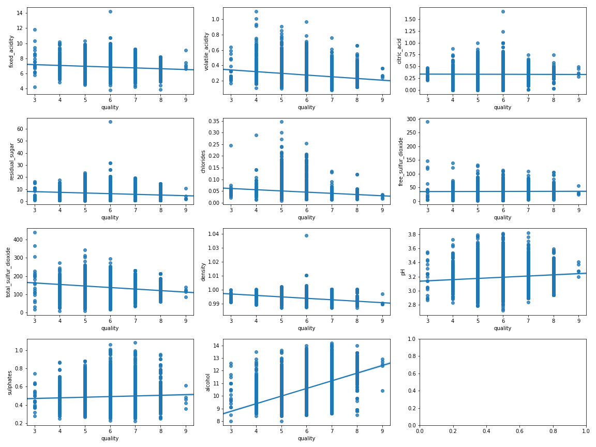
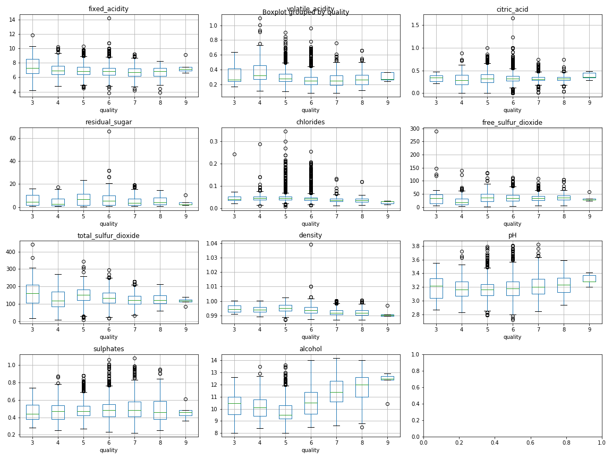
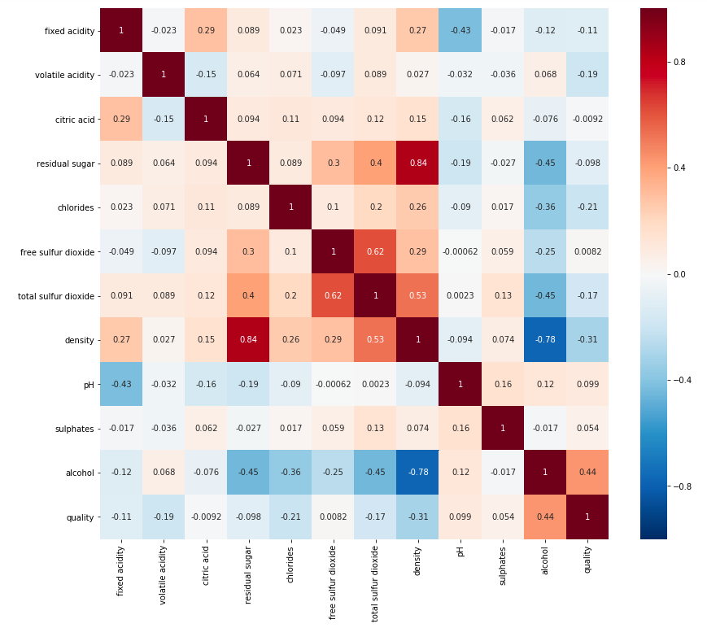
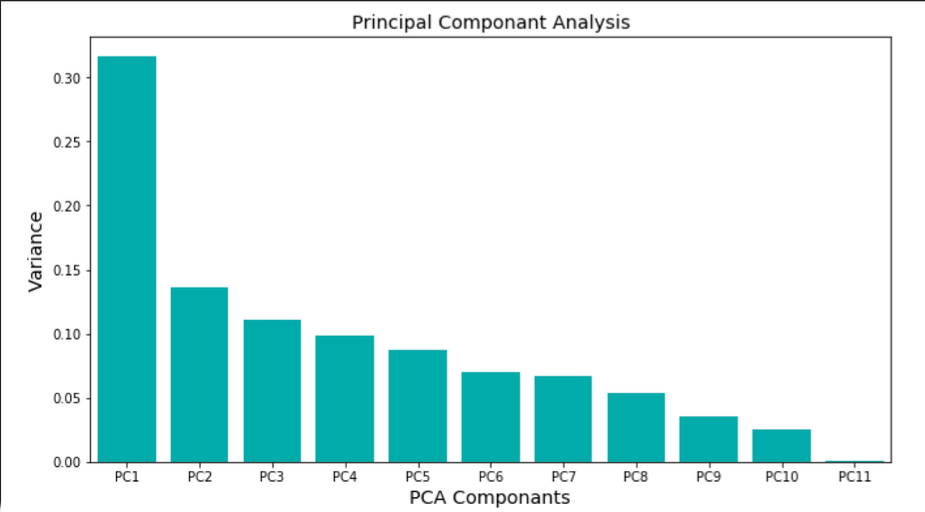
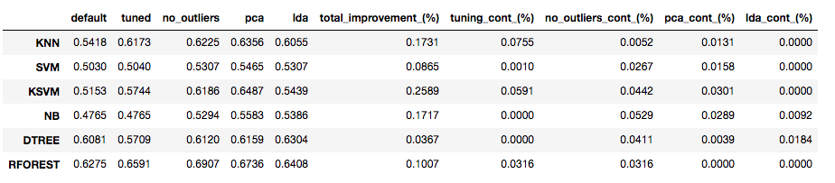
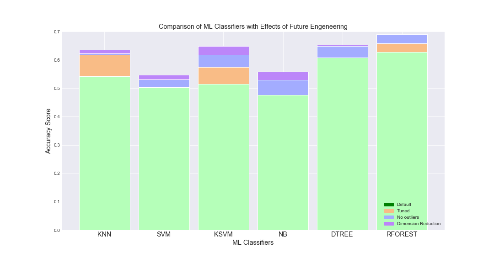

# Wine Analysis

# 1. Introduction

  ## 1.a. Why we need to do this analysis
  
  Everyone has an idea about the concept of wine quality. But when comes to defining precisely what that means there is often silence. For most wine critics, quality refers to what they personally consider ‘good’ versus ‘bad’ wine, and correspondingly desirable versus aversive. This is usually framed within the context of conformity relative to established, learned norms for the wines concerned. This indicates, and rightly so, that quality is not only subjective, but also involves both intrinsic (sensory) and extrinsic (contextual) components.
  
  There are specific reasons why it can better to ignore wine tasting notes, such as;
  
    * Tasting Notes can Prejudice or Influence Your Perception
    * Tasting Notes Can Set You Up for Failure
    * Tasting Notes Can Be Overwritten and Too Complicated
 
  ## 1.b. The problem

  As it can be concluded from above reasons, the problem is dependability of notes or scores of wine quality. We may not end the discussion on this topic but we can contribute. In order to make this contribution, we will try to predict wine quality with using its sensory inputs. 
  
  ## 1.c. The Dataset

  Two datasets are available of which one dataset is on red wine and have 1599 different varieties and the other is on white wine and have 4898 varieties. Only white wine data is analysed. All wines are produced in a particular area of Portugal. Data are collected on 12 different properties of the wines one of which is Quality, based on sensory data, and the rest are on chemical properties of the wines including density, acidity, alcohol content etc. All chemical properties of wines are continuous variables. Quality is an ordinal variable with possible ranking from 1 (worst) to 10 (best). Each variety of wine is tasted by three independent tasters and the final rank assigned is the median rank given by the tasters.

# 2. Data Wrangling and EDA

After data wrangling, in order to make some insights and get a better understanding EDA was implemented. And below plots created for this purpose:
  * Histogram plots
  * Distribution plot with curves
  * Scatter plots
  * Box plots
  * Violin plots
 
Here are some of the plots and heatmap of correlation matrix:

  
 ## EDA Findings
  
   *  All variables have outliers
   *  Quality has most values concentrated in the categories 5, 6 and 7. Only a small proportion is in the categories [3, 4] and [8, 9] and none in the categories [1, 2] and 10.
   *  Fixed acidity, volatile acidity and citric acid have outliers. If those outliers are eliminated distribution of the variables may be taken to be symmetric.
   *  Residual sugar has a positively skewed distribution; even after eliminating the outliers distribution will remain skewed.
   *  Some of the variables, e.g . free sulphur dioxide, density, have a few outliers but these are very different from the rest.
   *  Mostly outliers are on the larger side.
   *  Alcohol has an irregular shaped distribution but it does not have pronounced outliers.

# 3. Preprocessing

  * We made initial **future elimination** with using OLS relults (backward elimination technic). OLS summary showed us the most unrelated 3 features are "citric acid", "cholorides" and "total sulfur dioxide". 
  * We will also used the above EDA findings and removed additional 3 features which are clearly have almost even relationship with “quality”; "free sulfur dioxide", "fixed acidity" and "residual sugar". 
  * In order to improve our model performances all the **outliers have been cleaned** from the data set.
  * We used "principle component analysis" **(PCA) for dimension reduction** and we got the below result:

  
The first dimension explains about 31.6% of total variance, and we don't see any sharp drop off in the percentage of variance explained from this scree plot, suggesting no natural cut off point in keeping certain dimensions and discarding others. But we used first 5 components to be able to explain at least 80% of the variance.

# 4. Modeling

Six different machine learning algorithms have been used to predict the wine quality. Algorithms:
  * K-Nearest Neighbors (K-NN)
  * Support Vector Machine (SVM)
  * Kernel SVM
  * Naïve Bayes
  * Decision Tree
  * Random Forest

All models have five different accuracy scores. We got the first score (default) without applying hyper parameter tuning and out outlier cleaning; after hyper parameter tuning we got the second score; after outlier cleaning third one, after dimension reduction with PCA we got the forth one and fifth one after dimension reduction with LDA. And also contribution of the each step has been calculated in percentage. 

Below graph shows the general comparison of the algorithms over our data set and also effects of each step.

# 5. Conclusion

  * In this study, wine quality is tried to modeled with wine attributes (i) Fixed acidity (ii) Volatile acidity (iii) Citric acid (iv) Residual sugar (v) Chlorides (vi) Free sulfur dioxide (vii) Total sulfur dioxide (viii) Density (ix) pH (x) Sulfates (xi) Alcohol.
  * With the exception of alcohol, none of the attributes showed significant correlations to wine quality, indicating that they in fact cover different aspects of wine quality. However, as expected, no single predictor variable is able to fully describe all aspects of wine quality.
  * Even after cleaning the outliers and applied dimensional reduction, the best prediction was 69% which is with random forest. We also reached below findings: 
      **  We observed that hyperparameter tuning has an improving effect on scores up to 13%. 
      **  Cleaning Outliers made positive effects over all models.
      **  Principal Component Analysis generally made positive effect but did't affect Random Forest Model.

## Mext Step

  * Without full knowledge of each wine’s we can’t get high prediction scores. The results of this study can only serve as an initial look at quality.
  * It is therefore necessary to validate the reported findings on a more extensive sample set, including, but not limited to, retail price and the year the wine was made.

  

