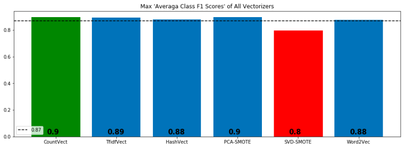

# Sentiment Analysis for Amazon Reviews: Final Report 

# 1. Introduction
  
  Sentiment analysis of product reviews is one of the most popular implementations of NLP (natural language processing). 
  In this analysis, I want to study the correlation between the Amazon product reviews and the rating of the products 
  given by the customers. I used traditional machine learning algorithms and deep neural networks. 
  Seven different traditional machine learning algorithms used with six different bag of words methods (CountVectorizer, 
  TfIdfVectorizer, HashingVectorizer, PCA with SMOTE Combination, Truncated SVD with SMOTE Combination, Word2Vec).
  
# 2. Conclusion Summary
  
  In this study, we tried to predict the sentiments of customers based on the reviews left by customers. Here are results of modeling:

•	As below plots show, best "F1 Scores" have been taken via "Logistic Regression" with CountVectorizer. 
-	Best average F1 Score is 90 %. 
-	Best minority F1 score is 48 %.
•	Kernel SVM and Random Forest showed poor performance over all.
•	SMOTE Combinations and Word2Vec Methods didn't work well except Logistic Regression.

## Average F-1 Scores of Different Methods

## Minor F-1 Scores of Different Methods

  
  
# 3. Folder and Files Description
     
     a. 01_deliverables:
           01_final_report.pdf: This is a pdf file which explain and visualize whole analysis.
           02_final_presentation.ppt: This file includes the presantation slides of the report.
     
     b. 02_notebooks: 
           Four different Jupyter Notebook files which covers the codes of data analysis
           
     c. 03_data:
           All data files which were used in the analysis
     
     d. 04_images:
           Images which were used in different files.
